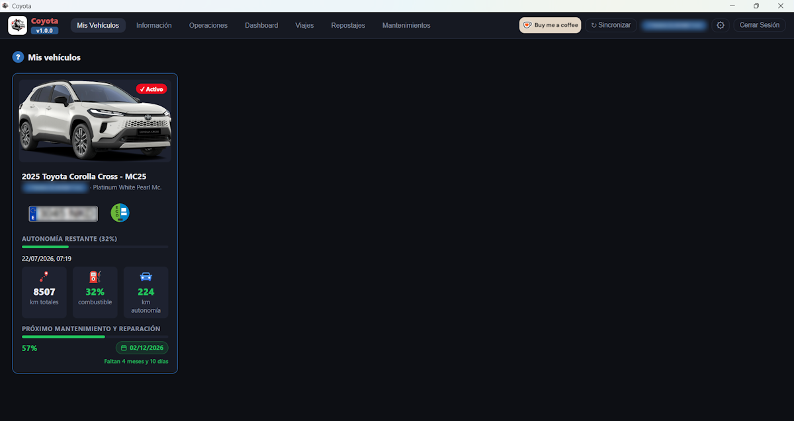

 

  

---

> [!IMPORTANT]
> **Aviso importante**
> `Aviso legal y exención de reponsabilidad`:
> 
> **Coyota Vehicle Manager** (aka **Coyota**) es una aplicación no oficial e independiente, sin ninguna afiliación, patrocinio, ni respaldo de Toyota Motor Corporation ni de ninguna de sus filiales.
> 
> El uso de Coyota implica la aceptación de que el autor no se hace responsable de ningún daño directo o indirecto, pérdida de datos, mal funcionamiento del vehículo, ni de cualquier otra consecuencia derivada del uso o mal uso de la misma.
> 
> El desarrollador de Coyota, queda exento de cualquier problema directo o indirecto derivado de su uso. La ejecución y uso de la aplicación, se realiza bajo la entera comprensión de los riestos -si los hubiera-, y la asunción de los mismos por parte del usuario.
> 
> Los datos del vehículo mostrados en Coyota, se obtienen directamente desde los servidores de Toyota mediante las credenciales personales que el usuario introduce, las cuales se almacenan de forma segura en el Keychain del sistema operativo.
> 
> Los datos que el usuario introduce, credenciales y cualquier otro que Coyota pudiera usar o gestionar, nunca se transmiten a terceros ni se usan para fines estadísticos, publicitarios o de cualquier otra índole. Toda la información recogida, por la aplicación, permanece almacenada localmente en el ordenador del usuario, y éste (el usuario) es el responsable de salvaguardar y gestionar dicha información de forma segura.
> 
> Coyota utiliza una API de la propia Toyota (`Toyota EU MyToyota ctpa-oneapi API`), y ésta queda fuera del alcance del desarrollador, por lo que en el caso de que ésta cambiara o Toyota dejara de dar el servicio, podría hacer que Coyota dejara de funcionar.
> 
> Al usar Coyota, el usuario de la misma admite que el autor de la aplicación, no posee obligación de ningún tipo de mejorar, actualizar, modificar o mantener Coyota a lo largo del tiempo, y no se le puede exigir responsabilidad alguna por su uso, matenimiento, soporte, pérdida de datos o cualquier otra circunstancia que ocasionara un perjuicio para el usuario.

## ¿Qué es Coyota Vehicle Manager?
> [!TIP]
> Es una aplicación multiplataforma para `Windows` y `macOS` (procesadores Apple Silicon únicamente), que permite gestionar tus vehículos Toyota y Lexus, `en español`, y **pensada inicialmente para el mercado Europeo de España**.
>
> Coyota no usa ningún paquete de terceros ni intermediarios de ningún tipo para conectarse a la API de Toyota ni gestionar su conectividad. Todo en Coyota está desarrollado desde cero con conexiones directas con Toyota.

> [!NOTE]
> Inicialmente el proyecto nació para dar soporte para `macOS Intel` también, pero la incompatibilidad de algunas funcionalidades a la hora de presentarlas en pantalla, hacía inviable esta vía, por lo que en la v0.6.1 se decidió eliminar esa posibilidad y sólo está disponible para **Windows**, **Linux** y **macOS Apple Silicon**.

La aplicación tiene diferentes secciones:
  |Sección|Descripción|
  |--|--|
  |**`Mis Vehículos`**|Listado de los vehículos asociados a tu cuenta de usuario Toyota, y selección del vehículo con el que operar (**por defecto se selecciona el primer vehículo**)|
  |**`Información`**|Información general sobre un vehículo (**VIN, Código Katashiki, Contrato, etc**), y de los datos que Toyota tiene del usuario (**Nombre, Email, Teléfono, etc**)|
  |**`Operaciones`**|Operaciones remotas a realizar sobre el vehículo (**actualmente deshabilitadas hasta poder confirmar su correcta operatibilidad**)|
  |**`Dashboard`**|Muestra el rendimiento mensual y general realizado con el vehículo, la última ubicación conocida del vehículo, y el estado del mismo según los datos devueltos por Toyota|
  |**`Viajes`**|Listado de viajes, sincronización de los mismos, y estadísticas (**si hay datos de repostajes añadidos**)|
  |**`Repostajes`**|Gestión de repostajes, pudiendo agregar gasolineras, registro del repostaje, y visualización de evolución de precios|
  |**`Mantenimientos`**|Historial de servicio de tu vehículo Toyota, de todas las revisiones, de cuando toca realizar el siguiente mantenimiento, posibles problemas detectados, y gestión de entradas al taller para hacer un seguimiento de los costes, tareas, etc|

## `Notas de Releases`
- [Histórico de Versiones](old_releases.md)

-  Se han añadido a los viajes, los **Comportamientos a la Conducción** del conductor en un trayecto concreto. Dentro del detalle de un viaje, se indica si hay comportamientos a la conducción o no, y cuántos. Y dentro del mapa, se podrá visualizar estos comportamientos y saber cuándo ocurrieron.
-  Se han añadido a los viajes, la posibilidad de mostrar parte de la ruta en **EV** y en **Combustión** de acuerdo a los datos devueltos por Toyota en cada punto registrado de la ruta.
-  Al pulsar el botón **Cerrar sesión**, el usuario debe confirmar si realmente quiere cerrar la sesión, para evitar que se haga accidentalmente.
-  Dentro de la sección **Mantenimientos**, y concretamente en el apartado *Historial de Servicio*, aparece ahora una lista desplegable de *Categorías* para que el usuario filtre los datos por todas las categorías (valor por defecto) o por una categoría concreta.
-  Ahora, cuando el usuario sitúa el puntero del ratón sobre el *VIN* que aparece a la derecha de la ventana en la barra superior de opciones, aparece la imagen del coche y la matrícula para identificar el vehículo activo.
-  Los botones de *sincronización* de **Mis Vehiculos** y **Viajes** han sido sustituidos por el botón **Sincronizar** de la barra de opciones.
-  Cuando el usuario accede sobre la sección **Mantenimientos** por primera vez, y el usuario no ha creado aún ningún taller, todos los talleres diferentes que aparezcan en el *Historial de Servicio*, se generarán automáticamente de forma básica.
-  Cuando el usuario accede sobre la sección **Mantenimientos** por primera vez, la aplicación generará una serie de valores por defecto para *Tipos*, *Tareas* y *Acciones*.
-  Se ha creado una nueva sección llamada <srtong>Configuración</srtong>.
-  Dentro de **Configuración** se podrá indicar la ruta en la que queremos que esté la base de datosde la aplicación.
-  Dentro de **Configuración** se podrá ejecutar una *Sincronización Completa* nuevamente, para que la aplicación actualice y descargue los viajes nuevamente.
-  Las ventanas emergentes de la aplicación se pueden cerrar ahora no sólo con el botón *Cerrar*, sino también haciendo clic fuera de su área.
-  Dentro de la sección **Mis Vehículos**, aparece el listado de vehículos asociados a la cuenta de usuario. Cuando un vehículo está seleccionado, el puntero del ratón es el estándar, y cuando uno de los vehículos del listado no está seleccionado, el puntero cambia para que el usuario sepa también que no está activo o seleccionado.
-  En la sección **Información**, *Etiqueta* se muestra ahora como *Etiqueta Medioambiental*.
-  Si los litros consumidos en una distancia eran 0 litros porque sólo se ha circulado en eléctrico, ese dato no aparecía. Aunque aparece aunque su valor sea 0 litros.
-  Dentro de la sección **Mantenimientos**, todos los registros de *Talleres*, *Tipos*, *Tareas* y *Addiones*, aparecen ahora ordenados albabéticamente.
-  Mejoras visuales en la selección de un viaje de su listado, y de un viaje seleccionado.
-  Mejoras visuales en las pantallas de *Tipos*, *Tareas* y *Acciones*.
-  La aplicación ahora, aparece maximizada por defecto.
-  A la hora de crear un **Nuevo repostaje** o editar uno existente, el *Tipo de Combustible* aparece ahora ordenado alfabéticamente.
-  Arreglado un `bug` por el cuál cuando se editaba un repostaje existente, el título era erróneamente **Nuevo repostaje** en lugar de **Editar repostaje**.

## Enlaces que pueden ser de interés

### Aplicaciones móviles oficiales Toyota
- [Toyota - MyToyota App para Android](https://play.google.com/store/apps/details?id=com.toyota.oneapp.eu)
- [Toyota - Mytoyota App para iOS](https://apps.apple.com/es/app/mytoyota/id1617623127)

### Aplicaciones móviles de terceros
- [Spritmonitor - para Android](https://play.google.com/store/apps/details?id=de.spritmonitor.smapp_mp&hl=es)
- [Spritmonitor - para iOS](https://apps.apple.com/es/app/spritmonitor-consume-costos/id616137163)

### Documentación de Toyota
- [Toyota - TME Customer REST API Documentation (Europa)](https://consumer-api.toyota-europe.com/docs/?json#tme-customer-rest-api)

### Librerías y aplicaciones de terceros (obsoletas)
- [Pypi.org - mytoyota - Python Client for Toyota Connected Services (sin actualizarse desde febrero del año 2025)](https://pypi.org/project/mytoyota/#history)
- [GitHub - tojota (sin actualizar desde hace más de 2 años)](https://github.com/calmjm/tojota)

### Aplicaciones de terceros que actualmente se mantienen
- [GitHub - ha_toyota (Toyota Europa - usa pytoyoda)](https://github.com/pytoyoda/ha_toyota/)
- [GitHub - ha_toyota_na (Toyota Norteamérica - usa pytoyoda)](https://github.com/widewing/ha-toyota-na)
- [GitHub - pytoyoda (Toyota Europa)](https://github.com/pytoyoda/pytoyoda)
