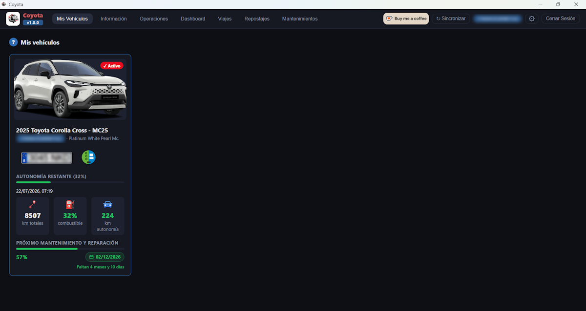

 

  

  

---

 

---

> [!IMPORTANT]
> **Aviso importante**
> `Aviso legal y exención de reponsabilidad`:
> 
> **Coyota Vehicle Manager** (aka **Coyota**) es una aplicación no oficial e independiente, sin ninguna afiliación, patrocinio, ni respaldo de Toyota Motor Corporation ni de ninguna de sus filiales.
> 
> El uso de Coyota implica la aceptación de que el autor no se hace responsable de ningún daño directo o indirecto, pérdida de datos, mal funcionamiento del vehículo, ni de cualquier otra consecuencia derivada del uso o mal uso de la misma.
> 
> El desarrollador de Coyota, queda exento de cualquier problema directo o indirecto derivado de su uso. La ejecución y uso de la aplicación, se realiza bajo la entera comprensión de los riestos -si los hubiera-, y la asunción de los mismos por parte del usuario.
> 
> Los datos del vehículo mostrados en Coyota, se obtienen directamente desde los servidores de Toyota mediante las credenciales personales que el usuario introduce, las cuales se almacenan de forma segura en el Keychain del sistema operativo.
> 
> Los datos que el usuario introduce, credenciales y cualquier otro que Coyota pudiera usar o gestionar, nunca se transmiten a terceros ni se usan para fines estadísticos, publicitarios o de cualquier otra índole. Toda la información recogida, por la aplicación, permanece almacenada localmente en el ordenador del usuario, y éste (el usuario) es el responsable de salvaguardar y gestionar dicha información de forma segura.
> 
> Coyota utiliza una API de la propia Toyota (`Toyota EU MyToyota ctpa-oneapi API`), y ésta queda fuera del alcance del desarrollador, por lo que en el caso de que ésta cambiara o Toyota dejara de dar el servicio, podría hacer que Coyota dejara de funcionar.
> 
> Al usar Coyota, el usuario de la misma admite que el autor de la aplicación, no posee obligación de ningún tipo de mejorar, actualizar, modificar o mantener Coyota a lo largo del tiempo, y no se le puede exigir responsabilidad alguna por su uso, matenimiento, soporte, pérdida de datos o cualquier otra circunstancia que ocasionara un perjuicio para el usuario.

## ¿Qué es Coyota Vehicle Manager?
> [!TIP]
> Es una aplicación multiplataforma para `Windows`, `Linux` y `macOS` (procesadores Apple Silicon únicamente), `en español`, y que permite gestionar tus vehículos Toyota y Lexus, y **pensada inicialmente para el mercado Europeo de España**.
>
> Coyota no usa ningún paquete de terceros ni intermediarios de ningún tipo para conectarse a la _API de Toyota_ ni gestionar su conectividad. Todo en Coyota está desarrollado desde cero con conexiones directas con Toyota.

> [!NOTE]
> Inicialmente el proyecto nació para dar soporte para `macOS Intel` también, pero la incompatibilidad de algunas funcionalidades a la hora de presentarlas en pantalla, hacía inviable esta vía, por lo que en la v0.6.1 se decidió eliminar esa posibilidad y sólo está disponible para **Windows**, **Linux** y **macOS Apple Silicon**.

La aplicación tiene diferentes secciones:
  |Sección|Descripción|
  |--|--|
  |**`Mis Vehículos`**|Listado de los vehículos asociados a tu cuenta de usuario Toyota, y selección del vehículo con el que operar (**por defecto se selecciona el primer vehículo**)|
  |**`Información`**|Información general sobre un vehículo (**VIN, Código Katashiki, Contrato, etc**), y de los datos que Toyota tiene del usuario (**Nombre, Email, Teléfono, etc**)|
  |**`Operaciones`**|Operaciones remotas a realizar sobre el vehículo (**actualmente deshabilitadas hasta poder confirmar su correcta operatibilidad**)|
  |**`Dashboard`**|Muestra el rendimiento mensual y general realizado con el vehículo, la última ubicación conocida del vehículo, y el estado del mismo según los datos devueltos por Toyota|
  |**`Viajes`**|Listado de viajes, sincronización de los mismos, y estadísticas (**si hay datos de repostajes añadidos**)|
  |**`Repostajes`**|Gestión de repostajes, pudiendo agregar gasolineras, registro del repostaje, y visualización de evolución de precios|
  |**`Mantenimientos`**|Historial de servicio de tu vehículo Toyota, de todas las revisiones, de cuando toca realizar el siguiente mantenimiento, posibles problemas detectados, y gestión de entradas al taller para hacer un seguimiento de los costes, tareas, etc|

## `Notas de Releases`

---

-  **Información** - Agregado en _Concesionario_ los campos para agregar el nombre del comercial que nos atendió y su email.
-  **Información** - Agregado en _Personalización_ el campo para agregar el precio aproximado que pagamos por el vehículo.
-  **Información** - Agregado en _Personalización_ el campo para agregar la marca, el tipo de neumático, la designación comercial del mismo, y su identificador, así como una caja de anotaciones para indicar otro tipo de neumático compatible, etc.
-  **Mantenimientos** - Agregado un nuevo campo para añadir comentarios a realizar en la próxima revisión del vehículo, y que no queremos olvidar.
-  **Repostajes** - Agregado en _Estadísticas_ una nueva opción en la lista desplegable para consultar el Gasto mensual realizado en los repostajes, incluyendo el número de repostajes y los litros total repostados durante los meses.
-  **Viajes** - Agregada la funcionalidad de poder ver los viajes _Similares_ a un viaje seleccionado, pudiendo incluir en ellos los que cambian el origen por el destino para meter viajes de ida y vuelta.
-  **Viajes** - Dentro de la funcionalidad de poder ver los viajes _Similares_, es posible ampliar o reducir un rango de metros en origen y destino, que por defecto es de 400 metros (casi medio kilómetro).
-  **Viajes** - Cuando se buscan viajes _Similares_, es posible agregar, modificar o eliminar tags en bloque a todos los viajes seleccionados.
-  **Viajes** - Se ha agregado una lista desplegable para filtrar los viajes según una etiqueta, de forma que pueden filtrar los viajes de alguna de las etiquetas indicadas (sobre todo si es más de una), los viajes que contienen las etiquetas indicadas mostrando también los viajes con más etiquetas de las indicadas, y los viajes que estrictamente tengan las etiquetas indicadas. De esta manera, se podrán filtrar los viajes con mayor granularidad.
-  **Viajes** - Los filtros pueden ser ahora expandidos o contraídos si queremos, para ganar espacio en la visualización de la información mostrada para un viaje.
-  **Información** - Se han renombrado los hitos principales dentro del Seguimiento de Fabricación para ser acordes a la información que envía Toyota al comprador y evitar malos entendidos.
-  **Repostajes** - El botón _Gasolineras_ se llama ahora _Mis Gasolineras_, que indica de forma uniquívoca el significado real de la acción detrás de ese botón.
-  **Repostajes** - El botón _Precios de carburantes_ ha sido rediseñado añadiendo un icono y cambiando su color de fondo y texto para hacerlo ligeramente destacable como funcionalidad especial de la aplicación.
-  **Repostajes** - El botón _Actualizar precios_ ha sido rediseñado siguiendo la misma línea de diseño del botón Precios de carburantes para destacarlo dentro de la ventana en la que aparece.
-  **Repostajes** - El botón _Ofertas_ ha sido rediseñado siguiendo la misma línea de diseño del botón _Actualizar precios_ y ha sido reemplazado después del botón _Vista general_.
-  **Repostajes** - El botón _Volver a Repostajes_ ha sido rediseñado para destacarlo ligeranebte sobre el resto de botones.
-  **Viajes** - Cuando se cambia la selección de viajes según un filtro, la parte en la que se muestra el detalle del viaje queda en blanco para evitar confusiones.
-  **Viajes** - Mejoras generales en la gestión de tags o etiquetas, y visualización de las mismas.
-  **Viajes** - Al crear una etiqueta o tag, el usuario verá un mensaje de creación correcta, y en el caso de que ya exista, un mensaje informando de esa situación.

## Enlaces que pueden ser de interés

### Aplicaciones móviles oficiales Toyota
- [Toyota - MyToyota App para Android](https://play.google.com/store/apps/details?id=com.toyota.oneapp.eu)
- [Toyota - Mytoyota App para iOS](https://apps.apple.com/es/app/mytoyota/id1617623127)

### Aplicaciones móviles de terceros
- [Spritmonitor - para Android](https://play.google.com/store/apps/details?id=de.spritmonitor.smapp_mp&hl=es)
- [Spritmonitor - para iOS](https://apps.apple.com/es/app/spritmonitor-consume-costos/id616137163)

### Documentación de Toyota
- [Toyota - TME Customer REST API Documentation (Europa)](https://consumer-api.toyota-europe.com/docs/?json#tme-customer-rest-api)

### Librerías y aplicaciones de terceros (obsoletas)
- [Pypi.org - mytoyota - Python Client for Toyota Connected Services (sin actualizarse desde febrero del año 2025)](https://pypi.org/project/mytoyota/#history)
- [GitHub - tojota (sin actualizar desde hace más de 2 años)](https://github.com/calmjm/tojota)

### Aplicaciones de terceros que actualmente se mantienen
- [GitHub - ha_toyota (Toyota Europa - usa pytoyoda)](https://github.com/pytoyoda/ha_toyota/)
- [GitHub - ha_toyota_na (Toyota Norteamérica - usa pytoyoda)](https://github.com/widewing/ha-toyota-na)
- [GitHub - pytoyoda (Toyota Europa)](https://github.com/pytoyoda/pytoyoda)

### Precio de carburantes en las gasolineras españolas
- [datos.gob.es](https://datos.gob.es/es/catalogo/e05068001-precio-de-carburantes-en-las-gasolineras-espanolas)
