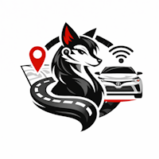

 

# Ayuda de Coyota Vehicle Manager

> [!NOTE]
>
> **Coyota** es una aplicación multiplataforma para `Windows`, `Linux` y `macOS` (procesadores Apple Silicon únicamente), `en español`, y que permite gestionar tus vehículos Toyota y Lexus, y **pensada inicialmente para el mercado Europeo de España**.
>
> **Coyota** no usa ningún paquete de terceros ni intermediarios de ningún tipo para conectarse a la _API de Toyota_ ni gestionar su conectividad. Todo en Coyota está desarrollado desde cero con conexiones directas con Toyota.

## Secciones dentro de Coyota

> [!IMPORTANT]
>
> **Coyota** no sólo se conecta a la _API de Toyota_ para obtener la información de tu vehículo y guardarla localmente en tu disco duro, sino que además, tiene una serie de funcionalidades extra añadidas que te permitirá agregar información de interés personalizada sobre tu vehículo y el concesionario en el que lo adquiriste, gestionar los gastos de repostajes, consultar la evolución de gastos de los mismos, consulta del precio actual de carburantes, operaciones de mantenimiento realizadas con tu taller oficial Toyota, etiquetar los viajes realizados para consultar los datos del mismo y estudiar tu comportamiento como conductor, exportar tus viajes para enviárselos a un familiar, amigo o consultarlo fuera de la propia aplicación, etc.

A continuación, se indican las diferentes secciones de la aplicación, y en cada una de ellas, se detalla las funcionalidades añadidas u cómo puedes usarlas.

La aplicación tiene diferentes secciones:

  |Sección|Descripción|
  |--|--|
  | [**`Login`**](help_login.md)|Ventana para acceder a **Coyota** (la aplicación utiliza las credenciales de **My Toyota** que permite sincronizar los datos locales obtenidos de Toyota)|
  | [**`Mis Vehículos`**](help_mis-vehiculos.md)|Listado de los vehículos asociados a tu cuenta de usuario Toyota, y selección del vehículo con el que operar (**por defecto se selecciona el primer vehículo**)|
  | [**`Información`**](help_informacion.md)|Información general sobre un vehículo (**VIN, Código Katashiki, Contrato, etc**), y de los datos que Toyota tiene del usuario (**Nombre, Email, Teléfono, etc**)|
  | [**`Operaciones`**](help_operaciones.md)|Operaciones remotas a realizar sobre el vehículo (**actualmente deshabilitadas hasta poder confirmar su correcta operatibilidad**)|
  | [**`Dashboard`**](help_dashboard.md)|Muestra el rendimiento mensual y general realizado con el vehículo, la última ubicación conocida del vehículo, y el estado del mismo según los datos devueltos por Toyota|
  | [**`Viajes`**](help_viajes.md)|Listado de viajes, sincronización de los mismos, y estadísticas (**si hay datos de repostajes añadidos**)|
  | [**`Repostajes`**](help_repostajes.md)|Gestión de repostajes, pudiendo agregar gasolineras, registro del repostaje, y visualización de evolución de precios|
  | [**`Mantenimientos`**](help_mantenimientos.md)|Historial de servicio de tu vehículo Toyota, de todas las revisiones, de cuando toca realizar el siguiente mantenimiento, posibles problemas detectados, y gestión de entradas al taller para hacer un seguimiento de los costes, tareas, etc|
  | [**`Configuración`**](help_configuracion.md)|Algunas acciones especiales de la aplicación las encontrarás en esta sección, pudiendo entre otras cosas, indicar la ruta en la que se encuentra la base de datos local en la que se guarda toda la información utilizada por Coyota|
