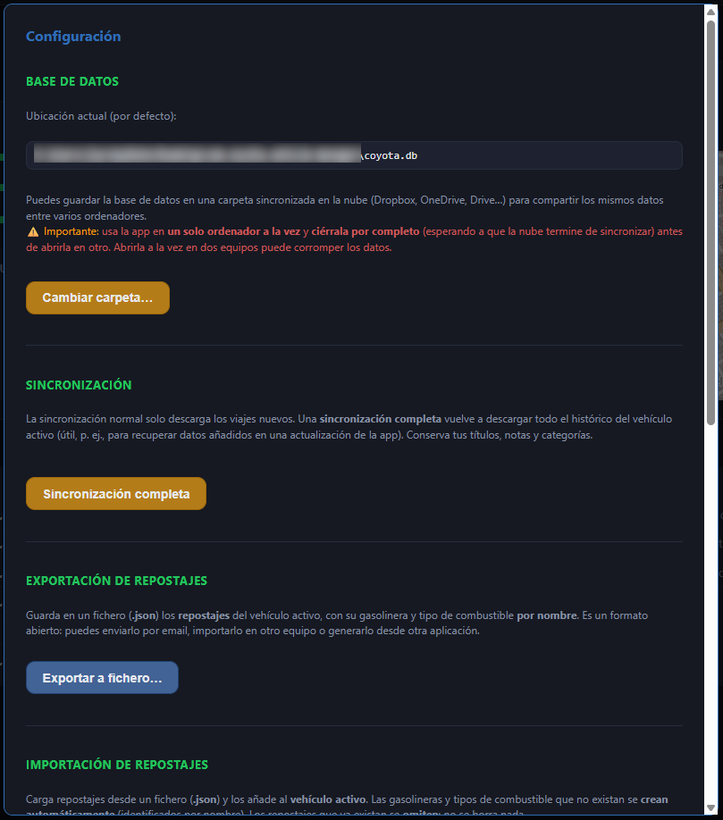

[ Atrás](README.md#section-configuracion)

#  `Configuración`

Para abrir la configuración de la aplicación, deberemos hacer clic en la rueda dentada que aparece en la parte superior derecha de la aplicación:

Aparecerá entonces una ventana similar a la siguiente:

 En esta ventana veremos varias opciones que pasamos a ver:

- **Base de datos** indica la ubicación en la que localizamos la base de datos de la aplicación y los archivos auxiliares utilizados internamente.

El botón **Cambiar carpeta** nos da la opción de cambiar la ubicación de la base de datos utilizada por la aplicación. 

Esto es especialmente útil si por ejemplo tenemos más de un ordenador que comparte la base de datos en un disco duro virtual en la nube, o si directamente lo queremos almacenar en la nube para guardar allí de forma segura el fichero que tiene los datos.

- **Sincronización** nos permite sincronizar los datos de los viajes de forma completa descargando todo forzando la descarga. **Es una opción a utilizar en caso extremo y habitualmente no será necesario realizar uso de esta opción.**

- **Exportación de repostajes** es la opción que nos permite exportar a disco los repostajes registrados en la aplicación, ya sea porque queremos guardar una copia de seguridad de los mismos o por otra razón.

- **Importación de repostajes** tiene dos opciones diferentes. Una importar los repostajes que podríamos haber exportado en la opción que hemos visto anteriormente, y otra, la posibilidad de importar los repostajes de la aplicación _Spritmonitor_. Hay muchos usuarios que usan o han usado esa aplicación, y el objetivo de esta opción es la de facilitar la migración de datos de esa aplicación a **Coyota**.

- **Datos de información** tiene dos opciones. Exportar los datos que tenemos en la sección **Información** de la aplicación, e importarlos nuevamente. La opción de exportar esos datos es para facilitarnos la posibilidad de hacer una copia de seguridad de los mismos, o usarlos para lo que consideremos.

- **Precios de carburantes** es un listado de los diferentes tipos de carburantes que aparecen registrados de acuerdo a los datos de precios de carburantes del Ministerio, y aparecen aquí para que el usuario indique qué carburantes quiero mostrar o filtrar en la aplicación cuando acceda a los datos de los precios de carburantes.

--- 

[ Atrás](README.md#section-configuracion)
