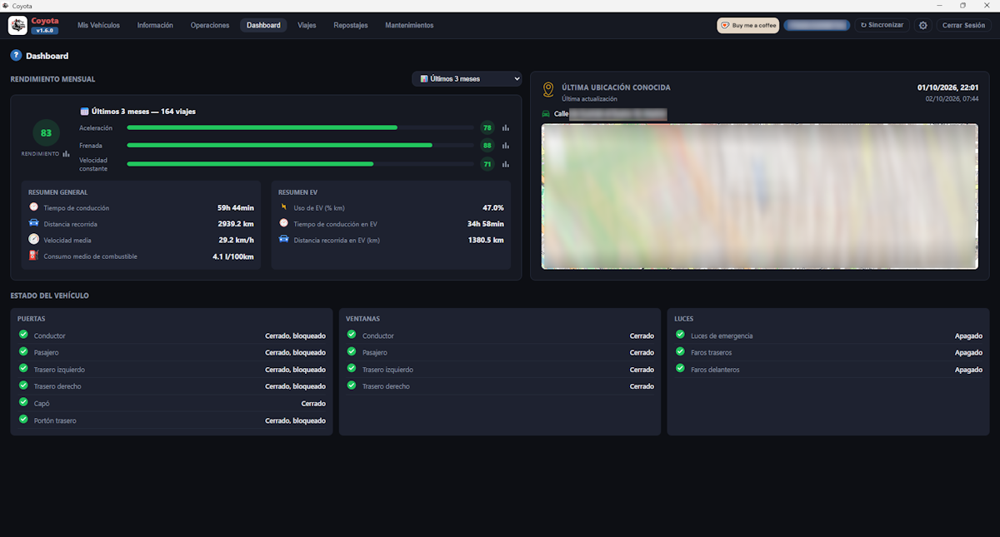
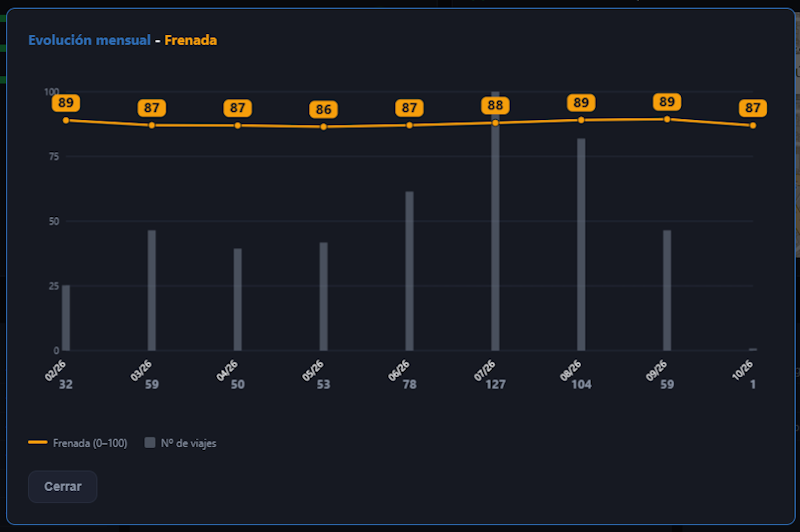

[ Atrás](README.md#section-dashboard)

#  `Dashboard`

En esta sección, se presenta información global del uso del vehículo, la ubicación del mismo y el estado en el que se encuentra.

Una imagen de esta ventana es la que se puede ver a continuación.

 Los bloques que forman parte de esta pantalla son los siguientes:

- **Rendimiento mensual** es la opción que está ubicada arriba a la derecha.

Se trata del resumen de uso que hacemos como conductores. Es posible filtrar los datos del último mes, los últimos 3, 6 y 12 meses, todos los meses o un rango personalizado. También es posible seleccionar los datos de un mes concreto.

De esta forma, tendremos un resumen global de **rendimiento**, **aceleración**, **frenada** y **velocidad constante**. En esta parte, tenemos un botón con forma de gráfica que nos presentará la comparativa de cada uno de estos datos con los meses seleccionados como se puede ver en la siguiente imagen.

Un poco más abajo vemos los bloques de datos principales con un **resumen general** con datos que indican el **tiempo de conducción**, la **distancia recorrida**, la **velocidad media**, y el **consumo medio de combustible**.

Y el **resumen EV** con datos que indican el **uso de EV en porcentaje de km**, el **tiempo de conducción en EV**, y la **distancia recorrida (km) en EV**.

- **Última ubicación conocida** es un apartado que muestra la ubicación registrada por Toyota en la que hemos dejado nuestro vehículo por última vez, la fecha y hora en la que ha sucedido ese evento, y por un último un mapa con esa posición.

- **Estado del vehículo** es un apartado que indica cómo se encuentra nuestro vehículo de acuerdo a los datos que Toyota devuelve del mismo. Si hubiera algún problema en nuestro coche, y Toyota lo hubiera registrado, aparecería aquí. Se trata de eventos relacionados con las **puertas**, **ventanas** y **luces** de nuestro vehículo.

--- 

[ Atrás](README.md#section-dashboard)
