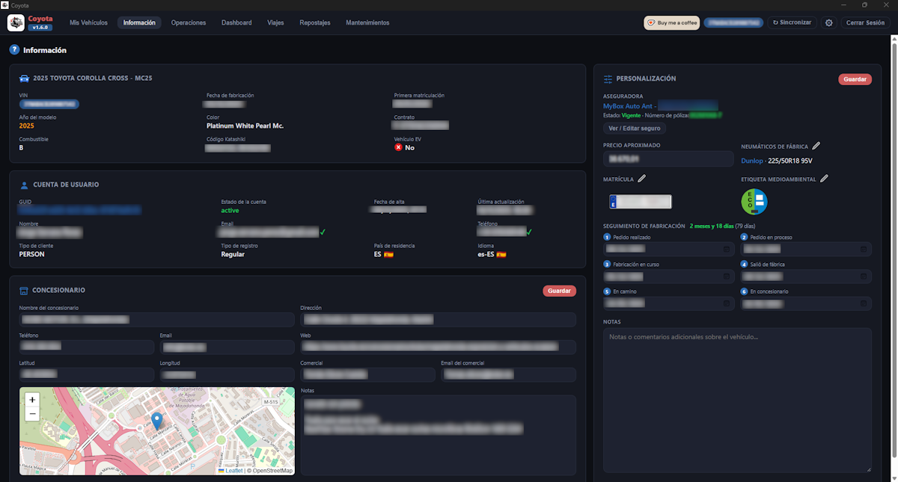

[ Atrás](README.md#section-informacion)

#  `Información`

Dentro de esta sección, tenemos diferentes bloques de información. Unos obtenidos directamente de Toyota, y otros que pueden ser agregados o cumplimentados por el usuario.

La idea de esta sección es la de aglutinar aquellos datos informativos que tenemos sobre nuestro vehículo, para acceder a ellos rápidamente, y consultarlos en cualquier momento que necesitemos.

La pantalla tiene un aspecto similar al siguiente:

 A continuación se explican los bloques que forman parte de esta pantalla:

* Los dos bloques principales están situados en la parte superior izquierda, y debajo de él. Se tratan de dos bloques de datos obtenidos de Toyota. Los datos de **Cuenta de Usuario**, representa los datos que tiene Toyota del usuario. Si alguno de estos datos son incorrectos, el usuario puede modificarlos en la aplicación **My Toyota**.
* El bloque situado en la parte inferior izquierda, representa los datos del **Concesionario**. Se trata de una sección con datos personalizados por el usuario del concesionario en el que se adquirió el vehículo, el nombre y email del comercial que nos atendió, y un campo de anotaciones por si queremos escribir algo que nos resulte de interés y que no queremos olvidar. Si ponemos la latitud y longitud del concesionario, aparecerá un mapa con la posición GPS del mismo.
* El bloque de la derecha que ocupa todo el alto de la ventana, representa los datos de **Personalización**. Se trata de datos introducidor manualmente también, pero de un ámbito general, informativo o de interés. En la parte superior de este bloque, se pueden indicar los datos de la aseguradora, y si el usuario hace clic en el botón **Ver / Editar seguro**, podremos indicar datos del seguro con una granularidad mayor. Otros campos informativos tienen que ver con el precio aproximado pagado, y los neumáticos que han venido de fábrica, aunque dentro de esta opción, también podemos ampliar los detalles con notas personalizadas. Debajo de esta información, el usuario puede indicar la matrícula de su coche y la etiqueta medioambiental, y siguiendo la explicación de datos, las fechas de cada una de las etapas de proceso de fabricación del coche desde la petición, hasta que llega al concesionario. Finalmente, podemos agregar notas o comentarios adicionales que resulten de interés.

--- 

[ Atrás](README.md#section-informacion)
