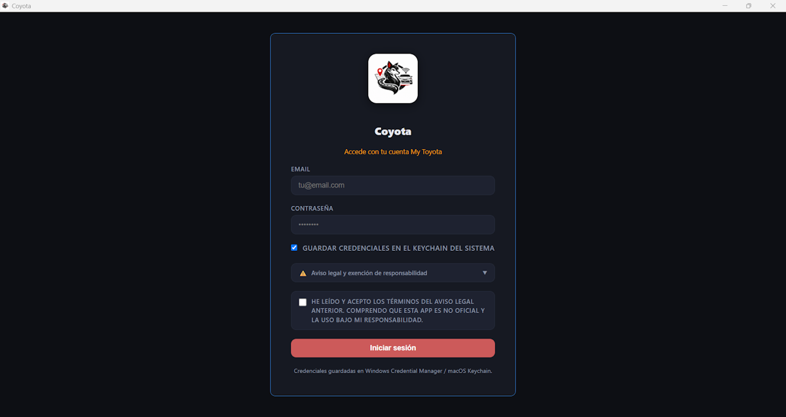

[ Atrás](README.md#section-login)

#  `Login`

Cuando inicias la aplicación por primera vez, cierras sesión, o el _token de usuario_ caduca, aparecerá una ventana en la aplicación similar a la siguiente:

 En esta ventana tendrás que:
* Indicar tus credenciales de la aplicación **My Toyota** (email y password).
* Podrás indicar si deseas almacenar en tu sistema las credenciales utilizadas o no.
* Y tendrás que aceptar los términos y condiciones para poder usar la aplicación. En caso contrario no podrás utilizar la aplicación. Los términos y condiciones, entre otras cosas, eximen al desarrollador de **Coyota** cualquier responsabilidad sobre el uso de la misma por parte del usuario.

Una vez que pulses el botón **Iniciar sesión**, **Coyota** se conectará a los servicios de Toyota para validar el usuario, y una vez recibida la comunicación existosa de la conexión, entrarás a la aplicación.

Tus credenciales de **My Toyota** son necesarias para poder recoger los datos que Toyota tiene sobre tu vehículo o vehículos si tienes más de uno asociado a tu misma cuenta.

> [!IMPORTANT]
>
> Como usuario, entiendo que puedas plantearte dudas de cómo actúa **Coyota** o qué hace por debajo en el caso de que pienses que pueda hacer algo _extraño_.
> Para tu tranquilidad, **Coyota** no rastrea, ni envía, ni trata los datos que manejes dentro de la aplicación con ningún otro sistema ni ningún propósito extraño.
> Todo lo que hagas lo harás en tu ordenador local y en la ruta que indiques para almacenar los datos.
> Puedes analizar con herramientas de seguridad la ida y vuelta de la información tratada, y cualquier comunicación de red, y no constatarás en **Coyota** nada que sea sospechoso.

--- 

[ Atrás](README.md#section-login)
