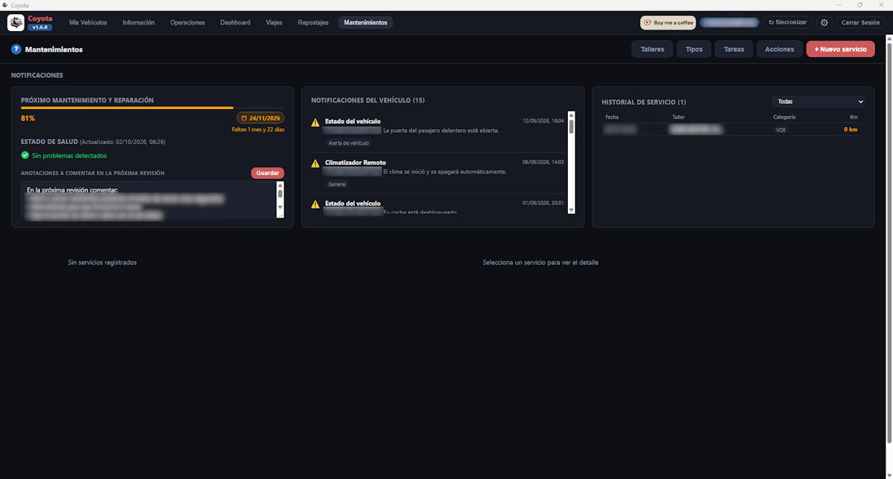
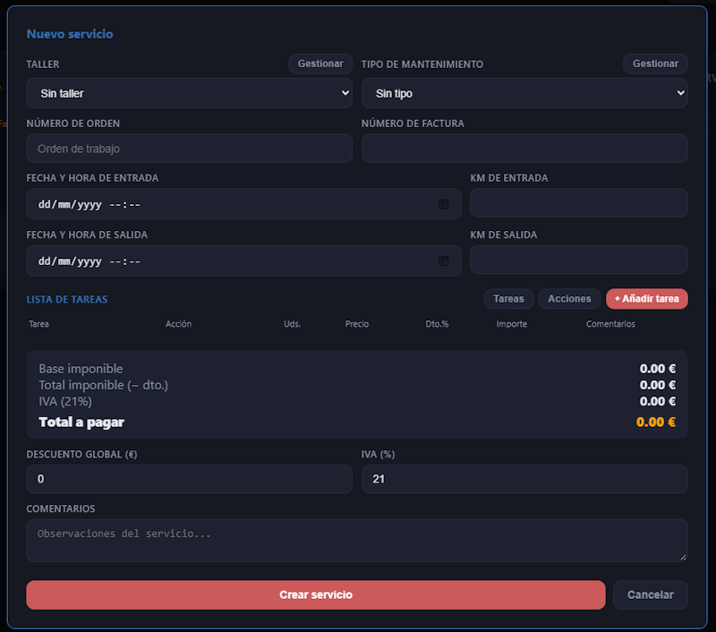

[ Atrás](README.md#section-mantenimientos)

#  `Mantenimientos`

Esta sección está relacionada con los mantenimientos que hemos realizado o que realizaremos a nuestro vehículo.

La ventana de esta sección tendrá un aspecto similar al siguiente:

 Esta ventana está dividida en varias secciones diferenciadas:

- **Próximo mantenimiento y reparación** indica cuando tenemos que pasar el próximo mantenimiento de acuerdo a los datos de Toyota, el estado de salud del vehículo, y anotaciones que queramos añadir para tenerlas en cuenta en la próxima revisión o lo que consideremos oportuno.

- Las **notificaciones del vehículo** son aquellos avisos que el coche ha generado y Toyota ha registrado (dejar una puerta abierta, una ventanilla bajada, no cerrar el vehículo, etc).

- El **historia de servicio** muestra todas las acciones que hemos realizado con nuestro vehículo. La primera acción que todos los vehiculos tendrán, es la de **VDE o entrega de vehículo**.

A partir de aquí, podrán aparecer más eventos, y podremos filtrarlos con la lista desplegable que aparece para seleccionar los eventos disponibles:
* VDE - Entrega de vehículo
* MNT - Mantenimiento
* HSC - Chequeo de la batería
* RPR - Reparación

- En la parte inferior de la ventana, tenemos la opción de registrar todos los eventos y costes repercutidos con las acciones que requieren una entrada al taller o que consideremos relevantes.

Para este propósito, tenemos en la parte superior varios botones, unos de gestión de datos, y otro de registro del mantenimiento en sí.

Las opciones relacionadas con la gestión de datos son:

* **Talleres** nos permite registrar los talleres a los que hemos llevado nuestro vehículo o tenemos pensado hacerlo. Por defecto, se crea el taller **VDE** aunque con los datos básicos, por lo que nosotros deberemos introducir esos datos manualmente si queremos completarlos.
* **Tipos** nos permite registrar los tipos de mantenimientos a realizar, como por ejemplo **Revisión Toyota Relax**.
* **Tareas** tiene como propósito, registrar la tarea concreta realizada sobre el vehículo. La primera vez que llevemos nuestro vehículo a un taller tendremos que registrar todas las tareas, pero en posteriores revisiones, la mayoría de esas tareas estarán registradas. Aquí tiene cabida cosas como "Filtro de Aceite", "Filtro Antipolen", "Líquido de Frenos", etc.
* **Acciones** por su parte, registra aquellas acciones realizadas en nuestro vehículo como por ejemplo "Averías", "Chequeos", "Mano de Obra", "Mantenimientos", "Recambios", etc.

La opción relacionada con el registro de un mantenimiento es:

* El botón **Nuevo servicio** es el registro en sí de la entrada a taller, reparación o mantenimiento.

Al pulsar sobre este botón, veremos una ventana similar a la siguiente:

Dentro de esta ventana, podremos indicar todos los datos anteriormente comentados, y cumplimentarlos según la orden de trabajo en taller.

Esto nos permite mantener un histórico de todo lo acontecido en nuestro vehículo, los costes asociados, y cuando se realizó el servicio.

--- 

[ Atrás](README.md#section-mantenimientos)
