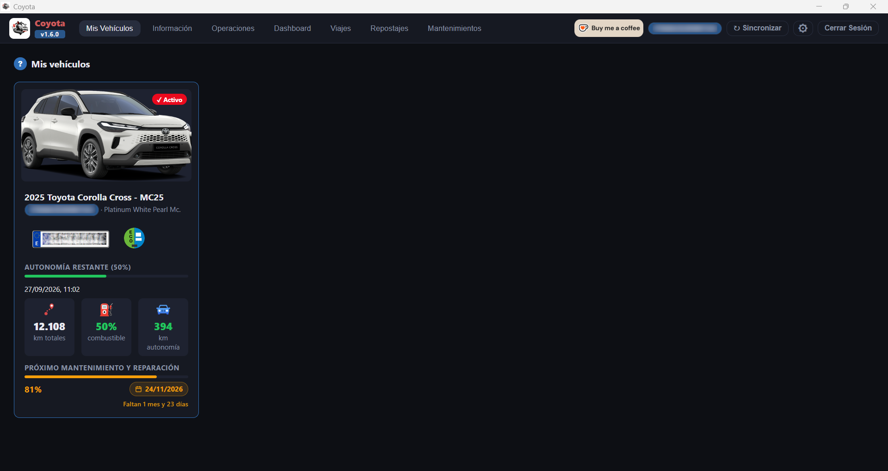

[ Atrás](README.md#section-mis-vehiculos)

#  `Mis Vehículos`

Una vez que has hecho [Login](help_login.md) en la aplicación, accederás a la pantalla principal de la aplicación donde se muestran todos los vehículos asociados a tu cuenta de usuario Toyota.

La selección del vehículo se hará por defecto sobre uno de ellos. Si sólo tienes asociado un vehículo a tu cuenta, la selección se realizará automáticamente y no te preocuparás por ello.

Si tienes más de un vehículo asociado a tu cuenta, podrás cambiar la selección del mismo en cualquier momento.

La pantalla que verás será similar a la siguiente:

Adicionalmente, acercando el puntero del ratón al **código VIN** que aparece en la parte superior derecha de la aplicación, verás el coche seleccionado en cualquier momento, de forma tal que si tienes varios vehículos en la aplicación, puedas en todo momento saber sobre qué vehículo estás viendo los datos.

En la ficha del vehículo podrás ver la siguiente información:
* Imagen del coche
* Tipo de modelo
* Color
* VIN
* Autonomía de combustible restante
* Km totales realizados
* Porcentaje de combustible restante
* Km aproximados de autonomía
* Cuando tienes que hacer el próximo mantenimiento y reparación (con valores estimativos)

Adicionalmente, puedes indicar la matrícula y el tipo de etiqueta medioambiental asociada a tu coche como datos informativos. Estos datos se pueden editar e indicar en la sección [Información](help_informacion.md)

--- 

[ Atrás](README.md#section-mis-vehiculos)
