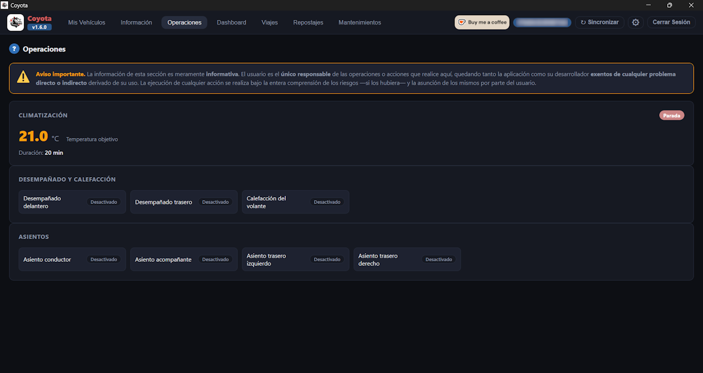

[ Atrás](README.md#section-operaciones)

#  `Operaciones`

Esta ventana tiene como propósito activar las acciones remotas sobre el vehículo.

La pantalla tiene un aspecto similar al siguiente:

 **Sin embargo, esta opción de acciones remotas, no está habilitada ni disponible por el momento a falta de pruebas y confirmación del correcto funcionamiento de las operaciones remotas.**

--- 

[ Atrás](README.md#section-operaciones)
