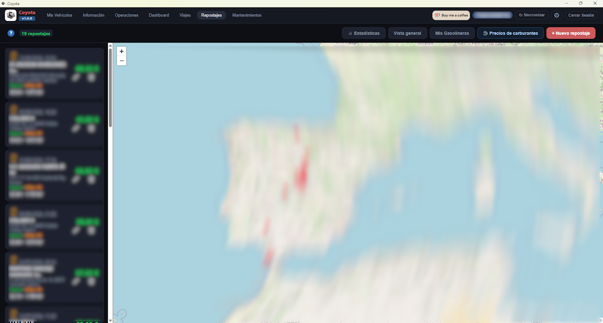
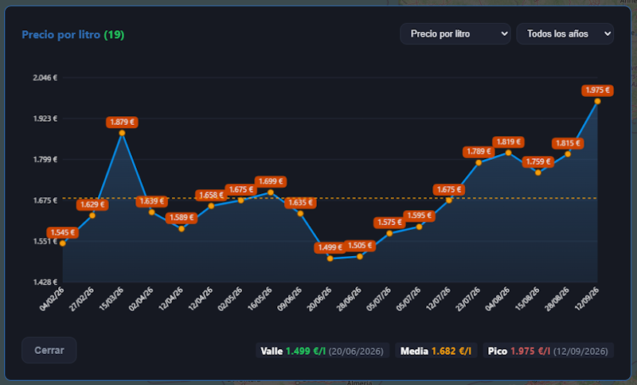
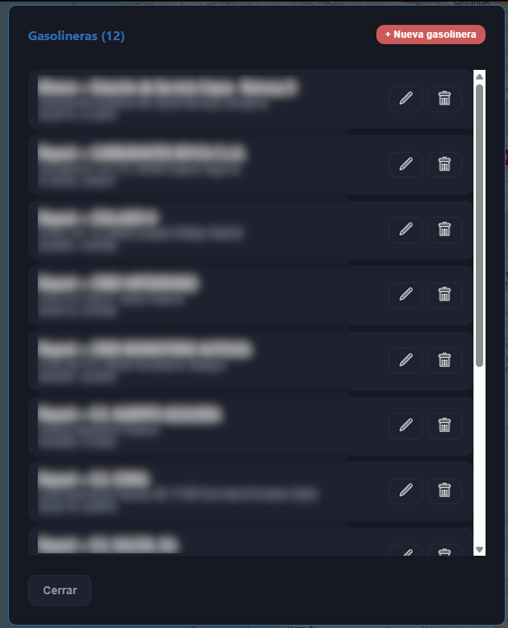
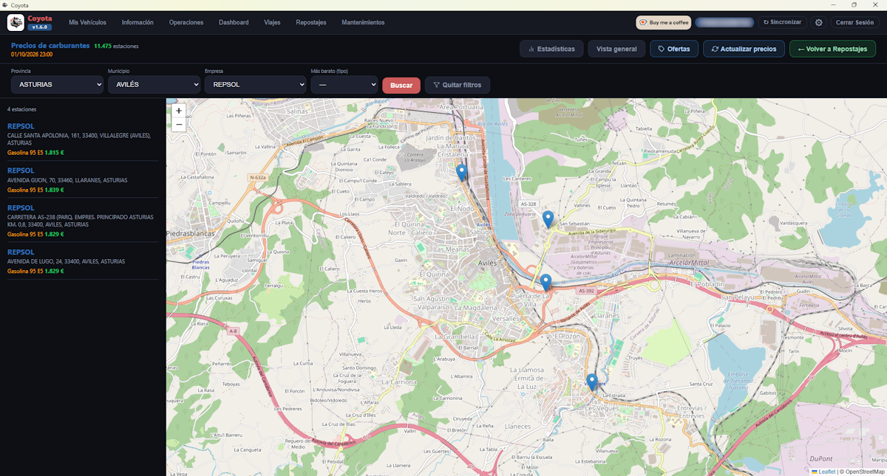

[ Atrás](README.md#section-repostajes)

#  `Repostajes`

Esta sección nos permite llevar la gestión de gasolineras y repostajes realizados.

Por defecto, esta ventana tendrá un aspecto similar al siguiente:

En la ventana, podremos movernos por el mapa para buscar una ubicación y hacer zoom, pero si queremos reestablecer la posición del mapa a su punto inicial, pulsaremos el botón **Vista general**.

En todo momento, podemos consultar los repostajes y editarlos.

Si hacemos clic sobre alguno de los repostajes que aparecen en el mapa, aparecerán los datos de los repostajes haya uno o más de uno localizado en la posición en la que se ha hecho clic.

 A continuación se explican los bloques que forman parte de esta pantalla:

- **Estadísticas** por defecto, nos permite visualizar en una gráfica la evolución de precios en nuestros repostajes, permitiéndonos conocer el precio valle y precio pico, y la media.

Los datos se pueden filtrar para:
* Todos los años
* Último mes
* Últimos 3 meses
* Últimos 6 meses
* Últimos 9 meses
* (o el año completo)

Un ejemplo de lo que se puede visualizar se muestra en la siguiente imagen:

Sin embargo, esta misma ventana es capaz de mostrar muchos más datos:
* Precio por litro
* Litros por repostaje
* Gasto por repostaje
* Gasto mensual

De esta forma y en un rápido vistazo, podemos ser capaces de analizar las consecuencias económicas que pueden tener la subida y bajada de precios de los combustibles y una eventual preparación de los mismos si nos interesara.

- El botón **Mis Gasolineras**, nos permite gestionar las gasolineras en las que hemos repostado combustible.

Al hacer clic en esta opción, veremos una ventana similar a la siguiente:

Desde esta ventana podremos crer, borrar o editar una gasolinera para agregar los datos de un repostaje.

**Pero existe también una forma muy cómoda de hacer esto que veremos a continuación en Precios de carburantes.**

- **Precios de carburantes** es una ventana adicional perteneciente a **Repostajes**, que nos permite consultar los precios de los carburantes de acuerdo a los datos del Ministerio, que se actualizan varias veces al día.

Esta ventana tiene el aspecto que se muestra a continuación:

Hay un botón **Actualizar precios** que se encarga de conectarse a los datos del Ministerio y actualizar los precios de acuerdo a los últimos datos compartidos.

Es posible que en algún momento, el servicio del Miniterio pueda devolver un error, ya que es un servicio que en algunos momentos del día recibe muchas peticiones y puede colapsarse.

Dentro de esta ventana, podemos filtrar los datos del mapa por **Provincia**, **Municipio**, **Empresa**, e incluso indicar el tipo de combustible más barato.

Los tipos de combustible que aparecen aquí, pueden ser configurados en la sección [Configuración](help_configuracion.md) de la aplicación.

Si queremos crear una gasolinera en **Mis Gasolineras** desde aquí, basta con hacer clic en la chincheta del mapa de la gasolinera, y pulsar el botón **Crear gasolinera**. Aparecerá una ventana emergente con los datos de esa gasolinera, y editaremos para personalizarlos como deseemos, y pulsaremos el botón **Crear gasolinera** nuevamente para crearla en **Mis Gasolineras**.

- Existe un botón especial llamado **Ofertas** que recoge las ofertas existentes en gasolineras y tarjetas de fidelización.

Esta información es extraída de los datos que comparte el Ministerio sobre las ofertas existentes.

Existe la posibilidad de alguna de estas ofertas no estén actualizadas o falten otras, pero aquí se muestra únicamente la información que el Ministerio comparte abiertamente sobre dichas ofertas.

--- 

[ Atrás](README.md#section-repostajes)
