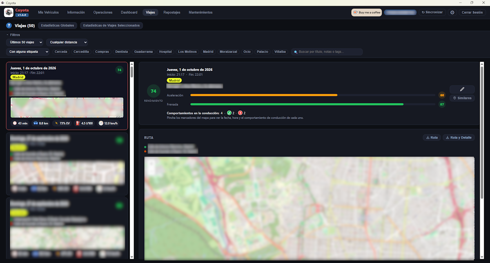

[ Atrás](README.md#section-viajes)

#  `Viajes`

Esta ventana recoge todo lo relativo a la gestión de viajes realizados con nuestro vehículo y registrados por Toyota.

> [!WARNING]
> 
> Hay un botón en la parte superior derecha que se llama **Sincronizar**. Este botón es **MUY IMPORTANTE** porque nos permite sincronizar los viajes con los servidores y servicios de Toyota, para recoger la información y guardarla en la base de datos local.

> [!IMPORTANT]
> Si no ves algún viaje, es posible que no hayas pulsado el botón **Sincronizar**, y si ves alguna incongruencia en los datos, es posible que tengas que ir a [Configuración](help_configuracion.md) y hacer clic en el botón **Sincronización completa**. Esto no es lo habitual y no es normal que suceda, pero si se da el caso, existe esa forma de _forzar_ a la aplicación para que intente recuperar información desde los servicios de Toyota.

La ventana de esta sección tendrá un aspecto similar al siguiente:

 A continuación se explican los detalles más importantes de esta sección y que conviene que conozcas para sacarle el máximo partido.

## Filtros

Existen unos filtros que se pueden expandir y contraer para ganar espacio en la pantalla.

### Selección de viajes

El primer filtro nos permite seleccionar el número de viajes.

Por defecto, aparecerán los últimos 50 viajes y con cualquier distancia.

Pero podríamos estar interesados en filtrar los último "n" viajes, siendo "n" el número que consideremos para no mostrar sólo 50, mostrar todos los viajes que tengamos (sabiendo que esta opción puede tomarse su tiempo dependiendo de la cantidad de viajes que tengamos registrados localmente), o entre dos fechas concretas.

También podemos filtrar por cualquier distancia, menor o mayor de una cantidad de kms concreta, o entre un rango de kms.

### Personalización de viajes

**Coyota** nos permite personalizar un viaje concreto, pudiendo indicar un título, notas e incluso tags o etiquetas asociadas a un viaje.

Esto nos permite además, filtrar por esa información o etiqueta, de forma que podamos localizar rápidamente un viaje.

### Filtros por tags o etiquetas

Esta opción merece una explicación aparte, porque existen tres posibilidades cuando queremos filtrar viajes por etiquetas.

Podremos localizar viajes que tengan alguna de las etiquetas indicadas, que tengan todas las etiquetas, o que estrictamente tengan sólo las etiquetas indicacadas.

Siempre podemos combinar la búsqueda de información por etiquetas con datos de título, notas e incluso kms.

## Detalles de un viaje

Cuando seleccionamos un viaje, éste aparece en la parte principal de la aplicación.

Ahí encontraremos la ruta realizada en un tamaño más grande, los eventos ocurridos, el resumen de conducción, y la posibilidad de encontrar viajes similares haciendo clic en el botón **Similares**.

Al hacer clic en **Similares**, debemos tener en cuenta que encontrará todos los viajes cuyo origen y destino se encuentren cercanos dentro de un radio de acción que por defecto es de 400 metros. Podemos variar ese radio de acción para hacerlo más corto y preciso, o más grande y que abarque una región más extensa.

Existe también la opción de elegir no sólo los viajes de ida y vuelta como similares, sino los que intercambian el origen por el destino y viceversa.

### Aplicación de etiquetas en cascada

Cuando tenemos viajes similares seleccionados, es posible aplicar las mismas etiquetas a todos ellos.

Basta son pulsar el botón **Etiquetas en bloque** que aparece en la parte superior, para seleccionar las etiquetas que queremos aplicar y pulsar el botón **Aplicar** en la ventana emergente.

## Estadísticas

Hay dos botones que nos permiten extraer datos estadísticos.

El botón global **Estadísticas Globales** sacará un informe global de todos los viajes registrados hasta el momento.

El botón **Estadísticas de Viajes Seleccionados**, nos permitirá sacar un informe de los viajes filtrados o seleccionados.

El informe mostrará datos de rendimiento, y estadísticas globales como tiempo de conducción, velocidad media, comportamientos en la conducción, etc.

## Exportación de datos

Puede ocurrir que en un momento dado, deseemos exportar un viaje concreto.

Cada ventana con el detalle del viaje, tiene dos botones **Ruta** y **Ruta y detalle**.

**Ruta** es un botón que nos permite exportar los datos del viaje en bruto, sin mayor detalle.

**Ruta y detalle** es un botón que nos permite exportar los datos del viaje y el detalle del mismo, con los eventos e información adicional.

Para visualizar estos datos fuera de **Coyota**, existe un visor HTML que lee los datos exportados por **Coyota** y que puedes descargar [coyota-visor.html](../visor/coyota-visor.html).

Puedes enviar los datos exportados de tu viaje a un amigo, indicarle dónde está el visor o enviárselo también, y podrá visualizar la información del viaje, ya sea la ruta o la ruta con su detalle.

> [!WARNING]
> Existe la posibilidad de que este visor deje de funcionar debido a las políticas de OpenStreetMap que cambian de forma inesperada en muchas ocasiones.
> 
> En el caso de que así sucediera, trataré de buscar una solución, aunque es algo que a veces lleva un trabajo extra complejo.

--- 

[ Atrás](README.md#section-viajes)
