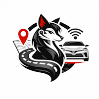

 

---

## Histórico de Versiones de Coyota

### v.0.7.1 - Julio 2026
- Añadido soporte para crear el paquete de instalación para **Linux (Ubuntu/Debian)**.
- *Publicada una versión de prueba para usuarios Linux para comprobar el correcto funcionamiento de la aplicación.*

### v.0.7.0 - Julio 2026
- _Coyota Vehicle Manager_ se llama ahora **Coyota**.
- *Publicada una versión de prueba para usuarios acotados/testers para comprobar el correcto funcionamiento de la aplicación.*

### v.0.6.2 - Julio 2026
- (_Actualización menor_) **Coyota Vehicle Manager** se llama ahora **Coyota**

### v.0.6.1 - Julio 2026
- Pruebas realizadas sobre **Windows 11**, **macOS Catalina Intel**, y **macOS Tahoe ARM (Apple Silicon) M2** para confirma el correcto funcionamiento de las funcionalidades, y la presentación
- En **macOS Catalina**, **WKWebView** es muy antiguo y obsoleto, y afecta en la presentación _CSS_. El coste de implementar personalizaciones sobre _Intel_ requiere reescribir y personalizar gran parte de la aplicación. Por esta razón, se descarta la distribución de **Coyota** en **macOS Intel**
- En **macOS ARM (Apple Silicon)** requiere pequeños ajustes en _CSS_, en concreto en la imagen del vehículo en la sección **Mis Vehículos** que distorsionaba la imagen. Después del cambio, esta ventana se presenta correctamente en **Windows 11** y en **macOS ARM (Apple Silicon)**

### v.0.6.0 - Julio 2026
- **`Finalización de la versión Beta tras comprobar su estabilización`**
- Siguiendo la coherencia del resto de funcionalidades dentro de la aplicación, **Estadísticas** está ahora en **Viajes** en lugar de en **Repostajes**
- Agregada la posibilidad de buscar _viajes en el último mes_
- Agregada el origen y destino automático a partir la longitud y latitud de elos, en el listado de **Viajes** y en el detalle de un viaje seleccionado
- Agregada la Velocidad media dentro de la lista de **Viajes**
- Agregados tooltips en cada elemento del listado de **Viajes**
- Agregada la dirección de última ubicación dentro del **Dashboard**
- Mejoras en el filtrado de datos del **Dashboard** para hacerlo más adecuado al diseño de la aplicación
- Agregada en la sección **Dashboard**, la posibilidad de comparar el rendimiento, aceleración y frenada en las agrupaciones mensuales
- Añadida alerta al usuario cuando el mantenimiento esté próximo

### v.0.5.0 - Julio 2026
- Actualización de algunas llamadas de la **API de Toyota**, que ha cambiado sin previo aviso e impactaba a la aplicación, dejándola de funcionar en algunas de sus secciones
- Rediseño de la sección de **Operaciones** de acuerdo a los cambios de la API de Toyota
- Rediseño de la sección **Mantenimientos** para unificar criterios
- Añadido el **apartado de luces** en las alertas del vehículo
- Agregada la gestión de tags múltiples, búsqueda por tags y por texto dentro de los viajes
- Mejoras de diseño en la sección **Información**, y concretamente en **Personalización**
- Cambio y unificación de algunos iconos en todas las ventanas de la aplicación
- Resuelto un bug en **Repostajes**. Cuando se editaba un repostaje, la fecha y hora cambiaba a UTC

### v.0.4.0 - Junio 2026
- Rediseño de la pantalla principal (**Mis Vehículos**)
- Agregada la sección de **Mantenimiento** y gestión de operaciones en taller con el coche
- Recolocación del **Dashboard** en la aplicación
- Creación de la sección **Información**
- Resolución de un bug que implicaba que la aplicación no refrescara automáticamente el token de usuario, cuando estando la aplicación abierta, el token caducaba

### v.0.3.0 - Mayo 2026
- Agregado en **Repostajes** el apartado de **Estadísticas**
- Dentro de **Repostajes**, mejoras en la gráfica de **Precios de la gasolina**
- Mejoras en **Viajes**. Agregado color de fondo y de letra para las **Categorías** de los viajes
- Unificación de **Notificaciones** dentro del **Dashboard**
- Estabilización y pequeños reajustes de iconos y de UX
- Consolidación final de los bloques principales de la aplicación

### v.0.2.0 - Abril 2026
- Mejoras para la estabilización de la aplicación
- Agregada **Velocidad Constante** en los **Viajes** y **Dashboard**
- Reaplicación de colores para valores por debajo del valor óptimo en **Aceleración**, **Frenada** y **Velocidad constante**
- En la pantalla inicial, aparecen ahora además de los km del vehículo, los km y % de combustible restante también
- Ahora se tendrá que crear una gasolinera antes de agregar un consumo, para que cuando el usuario quiera agregar un consumo, tenga que seleccionar una gasolinera existente obligatoriamente
- Agregada la posibilidad de categorizar los viajes

### v.0.1.0 - Marzo 2026
- Primera versión funcional Beta de **Coyota Vehicle Manager**
- Autenticación con cuenta **My Toyota** (_OAuth/ForgeRock de varios pasos_) [autenticación → autorización → obtención del token de usuario]
- **Dashboard** con estado del vehículo, ubicación y rendimiento mensual
- Listado y sincronización de viajes con mapas de ruta
- Gestión de repostajes con mapa de ubicaciones
- Información del vehículo: matrícula, etiqueta medioambiental, aseguradora
- _Splash screen_ con logo personalizado

### v.0.0.1 - Febrero 2026
- Primera versión _alpha_ de **Coyota Vehicle Manager**
- Creación de estructura general y secciones
- Conexiones a la **API de Toyota**
- Gestión de **Login y Token**
